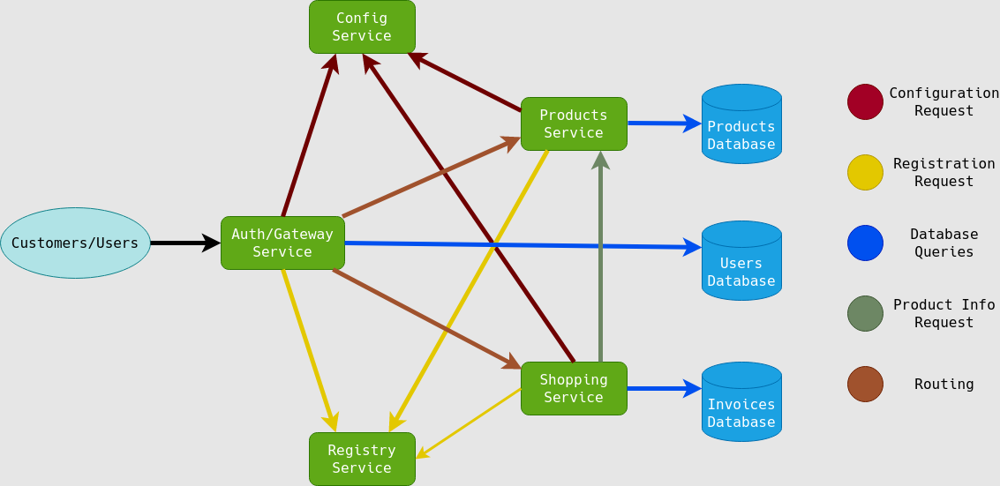

# Online Store

This project consists of the REST api for an online store using microservices architecture.

My goal whit this project is to use all knowledge that i have acquired over the course of 8 months in a self-taught way to create a rest-full amateur application for an online store.

## Microservices

* **Product-Service** microservice in charge of products management. [Commands and Endpoints](https://github.com/SirNoob97/OnlineStore/blob/master/product-service/README.md)
* **Auth-Service** microservice in charge of user authentication and authorization, as well as acting as the application gateway. [Commands and Endpoints](https://github.com/SirNoob97/OnlineStore/blob/master/auth-service/README.md)
* **Shopping-Service** microservice in charge of invoice management, to generate invoices it is necessary for this microservice to make requests to products-services, so it is also a client. [Commands and Endpoints](https://github.com/SirNoob97/OnlineStore/blob/master/shopping-service/README.md)

These will obtain their configuration from this repository through a centralized configuration service that will use the Spring Cloud Config Server dependency.

Eureka dependencies will be used for the discovery of all services.

Hystrix's will be used for monitoring thaks to Actuator and Admin Starter, which will provide the information generated by Actuator in a separate and more readable endpoint.

Cloud Gateway to have a single acces endpoint.

Spring Security and JWT for the users authentication and authorization.

## Prerequisites

* [Java 11](https://openjdk.java.net/).
* [Maven](https://maven.apache.org/).
* [Docker and Docker Compose](https://www.docker.com/).

## Gettin Started

### Spring-boot Maven Plugin

To run config-service and registration-service, you just need to use this command:

    mvn clean compile spring-boot: run

The other microservices have their own README file that contains the commands to run the microservice using the spring-boot maven plugin.

### Docker

To run the application with Docker, use the run.sh.

This script runs the application to be used with a Postgres database.

Using the "depends_on" option of docker-compose does not ensure that the microservice or the database is ready to receive requests, so I have created this little script to ensure the order of execution and thus avoid conflicts.

    ./run.sh

If you use this method you should use the respective ips of the microservices instead of "localhost".

* PostgreSQL: 192.168.0.21
* Config-Service: 192.168.0.2
* Resgistry-Service: 192.168.0.3
* Auth-Service: 192.168.0.11 (Gateway)
* Product-Service: 192.168.0.12
* Shopping-Service: 192.168.0.13

Ideally, only the auth-service ip should be set as it also acts as the application gateway (this is the reason why only this service exposes its port to one of my host).
In this way, with all the services with fixed ip, I can test the application in a faster way for me and more friendly for my pc (without having to use the gateway to test the other services).

### Dependencies

* Spring Boot
  * Web MVC [docs](https://docs.spring.io/spring-framework/docs/current/reference/html/web.html#spring-web)
  * Web Flux [docs](https://docs.spring.io/spring-framework/docs/current/reference/html/web-reactive.html#spring-webflux)
  * Junit, Mockito [docs](https://docs.spring.io/spring-framework/docs/current/reference/html/testing.html#testing)
  * JPA [docs](https://docs.spring.io/spring-data/jpa/docs/current/reference/html/#reference)
  * R2DBC [ref](https://r2dbc.io/) [spring docs](https://docs.spring.io/spring-data/r2dbc/docs/current/reference/html/#reference) [repo](https://github.com/r2dbc)
  * Security [docs](https://docs.spring.io/spring-security/site/docs/current/reference/html5/)
  * Actuator [docs](https://docs.spring.io/spring-boot/docs/current/reference/htmlsingle/#production-ready)
  * Codecentric Spring Boot Admin [docs](https://codecentric.github.io/spring-boot-admin/current/)

* Spring Cloud
  * Config [docs](https://docs.spring.io/spring-cloud-config/docs/current/reference/html/)
  * Gateway [docs](https://docs.spring.io/spring-cloud-gateway/docs/current/reference/html/)
  * Openfeign [docs](https://docs.spring.io/spring-cloud-openfeign/docs/current/reference/html/)
  * Netflix Eureka Server [docs](https://docs.spring.io/spring-cloud-netflix/docs/current/reference/html/)
  * Netflix Hystrix [repo](https://github.com/Netflix/Hystrix)
  * Netflix Hystrix Dashboard [repo](https://github.com/Netflix-Skunkworks/hystrix-dashboard)
  * Sleuth [docs](https://docs.spring.io/spring-cloud-sleuth/docs/current/reference/html/)

* Zipkin [docs](https://docs.spring.io/spring-cloud-sleuth/docs/current/reference/html/) [repo](https://github.com/openzipkin/zipkin)
* JWT [repo](https://github.com/jwtk/jjwt)
* H2 [ref](https://www.h2database.com/html/main.html) [repo](https://github.com/h2database/h2database)
* PostgreSQL [postgres docs](https://www.postgresql.org/docs/13/index.html)
* Lombok [ref](https://projectlombok.org/) [repo](https://github.com/rzwitserloot/lombok)

### TODO

* ***Add security to each microservice.***
* Add Unit and Integration Test for shopping-service.
* Implement Customer-Service, auth-service client microservice and with which customers can add/edit more information to their account.
* Decrease repeating code as much as possible.
* Implement Admin-Service.
* Add Zipkin server.

---
Due to the performance required by the application, the admin-server and zipkin-server will be omitted from the application :c
