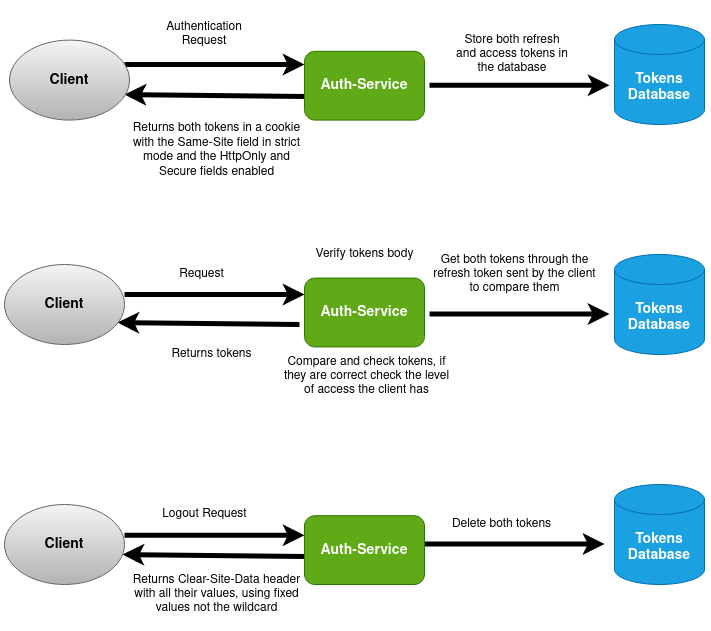

# Auth-Service

Microservice in charge of user authentication/authorization and acting as a gateway.

## Execution Commands

TEST spring and maven profile

    mvn clean compile spring-boot:run -Dspring-boot.run.profiles=test -P test

POSTGRESQL spring and maven profile

    mvn clean compile spring-boot:run -Dspring-boot.run.profiles=postgresql -P postgresql

## Endpoints

If you are using docker-compose you should use the respective IP of this microservice instead of "localhost"

    192.168.0.11

### Auth

POST register a new CUSTOMER account

    curl -v -X POST http://localhost:8090/auth/signup \
      -H 'Content-Type: application/json' -H 'Accept: application/json' \
      --data-raw '{
      "userName": "user",
      "password": "user",
      "email": "user@email.com"
      }' | jq

POST start a new session with an existing account

    curl -v -X POST http://localhost:8090/auth/login \
    -H 'Content-Type: application/json' -H 'Accept: application/json' \
    --data-raw '{
      "userName": "test",
      "password": "test"
    }' | jq

!!!From this point, remember to replace the phrase 'valid token' with the cookies returned by the registration(signup) and login endpoints!!!
---

POST refresh the session and avoid losing the authentication in the app

    curl -v -X POST http://localhost:8090/auth/refresh-token \
    -b 'JWT=valid-token; Secure; HttpOnly; Same-Site=Strict; RT=valid-token; Secure; HttpOnly; Same-Site=Strict;'

POST logout(this endpoint removes the refresh-token of the current session from the database and the front end should get rid of the user's jwt, a simple way to execute this function)

    curl -v -X POST http://localhost:8090/auth/logout \
    -b 'JWT=valid-token; Secure; HttpOnly; Same-Site=Strict; RT=valid-token; Secure; HttpOnly; Same-Site=Strict;'

GET obtain the current user, this is necessary since it is the only way that I allow customers to know their id and to be able to edit their accounts, the password or delete their accounts

    curl -v -X GET http://localhost:8090/users \
    -b 'JWT=valid-token; Secure; HttpOnly; Same-Site=Strict; RT=valid-token; Secure; HttpOnly; Same-Site=Strict;' \
    | jq

### Accounts

POST register a new account of any role(admin only)

    curl -v -X POST http://localhost:8090/accounts \
      -H 'Content-Type: application/json' -H 'Accept: application/json' \
      -b 'JWT=valid-token; Secure; HttpOnly; Same-Site=Strict; RT=valid-token; Secure; HttpOnly; Same-Site=Strict;' \
      --data-raw '{
      "userName": "new user",
      "password": "new user",
      "email": "new@test.gmail",
      "role": "ADMIN"
      }' | jq

GET all accounts(admin only)

    curl -v -X GET http://localhost:8090/accounts \
    -b 'JWT=valid-token; Secure; HttpOnly; Same-Site=Strict; RT=valid-token; Secure; HttpOnly; Same-Site=Strict;' \
    -H 'Accept: application/json' | jq

PUT edit an account(the user only needs to be authenticated, since only administrators have access to any user's id while employees and customers can only know their own)

    curl -v -X PUT http://localhost:8090/accounts \
      -H 'Content-Type: application/json' -H 'Accept: application/json' \
      -b 'JWT=valid-token; Secure; HttpOnly; Same-Site=Strict; RT=valid-token; Secure; HttpOnly; Same-Site=Strict;' \
      --data-raw '{
      "userId": 3,
      "userName": "updatetest",
      "email": "updatetest@test.gmail",
      "password": "updatepassword",
      "role": "EMPLOYEE"
      }' | jq

PUT edit the password of the account (like the account edit function, the user must only be authenticated)

    curl -v -X PUT http://localhost:8090/accounts/passwords \
      -H 'Content-Type: application/json' -H 'Accept: application/json' \
      -b 'JWT=valid-token; Secure; HttpOnly; Same-Site=Strict; RT=valid-token; Secure; HttpOnly; Same-Site=Strict;' \
      --data-raw '{
      "userId": 3,
      "password": "updatepassword"
      }' | jq

DELETE delete the account(user must only be authenticated)

    curl -v -X DELETE http://localhost:8090/accounts/1 \
    -b 'JWT=valid-token; Secure; HttpOnly; Same-Site=Strict; RT=valid-token; Secure; HttpOnly; Same-Site=Strict;'

### Other Services

To access the endpoints of the other services, you must set the header 'Host' with the name of the service. actuator endpoints too

    --header 'Host: product-service'
    --header 'Host: shopping-service'

### Actuator

The following endpoints are excluded: env,beans,heapdump,flyway,threaddump,liquidbase,prometheus

    curl -v -X GET http://localhost:8090/actuator/**

To access the product-service or shopping-service actuator endpoints

    curl -v -X GET http://localhost:8090/product-service/actuator/** --header 'Host: product-service'
    curl -v -X GET http://localhost:8090/shopping-service/actuator/** --header 'Host: shopping-service'
